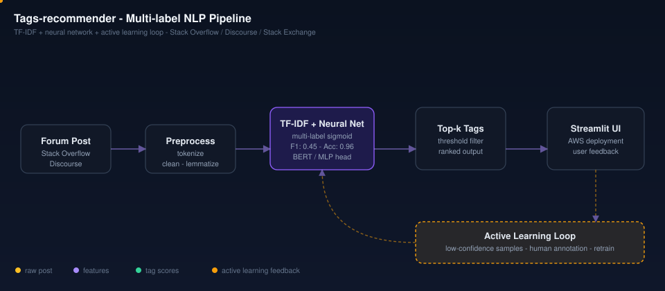

# Tags-recommender-system-for-community-forums
Tags recommender system for the community forums. Works for forums like Stack Overflow, Stack Exchange, Discourse, Codechef etc.,.  

## Architecture

**Pipeline:** Forum post -> preprocess (tokenize, lemmatize) -> TF-IDF + neural net multi-label sigmoid -> top-k ranked tags -> Streamlit UI -> active learning loop feeds low-confidence samples back for human annotation and retraining.

## Project Collaborators:
1. Architecture and Project Planning - Saad Ahmad and Somya Goswami
2. Deep Learning SME - Somya Goswami
3. Active Learning - Saad Ahmad
4. Tag Recommender with TF-IDF with Neural Networks - Hui Wen
5. Tag Recommender integration with Active Learning loop, Streamlit Deployment and AWS migration - Sai Likhith
## Project Demo

[Dataset](./webscraping_stack4.xlsx)

I was intrigued going through this amazing article on building a multi-label image classification model last week. The data scientist enthusiast in me started exploring possibilities of transforming this idea into a Natural Language Processing (NLP) problem.

Most of the NLP tutorials are dealing with idea of single-label classification challenges. But community forum posts are not one-dimensional. One post can span several tags. 

#### For example: 

##### Post: How to do webscraping using python and Selenium? 
##### Tags: webscraping, python, selenium.

In the above scenerio, three tags are used for classification. Now THAT is a challenge, I would love to take up and embrace as a data scientist enthusiast. 

#### I extracted a bunch of tags and topics from Stack Exchange, Stack Overflow and got down to work using this concept of multi-label classification. 

And the results, even using a simple model, are truly impressive.

### F1 Score- 0.45 , Accuracy is 0.96 for my scraped dataset. 

See [llms.txt](./llms.txt) for an AI-readable project summary and cross-links to related AI/ML work.

